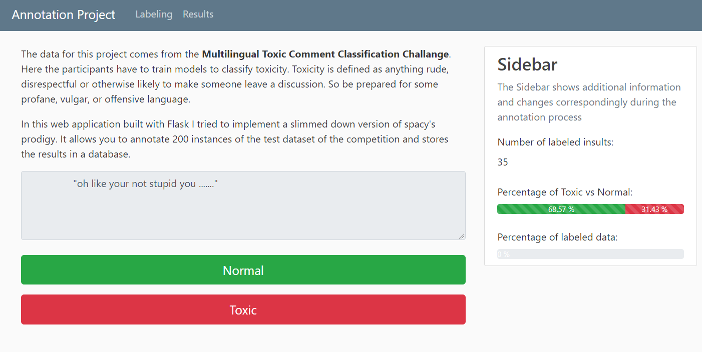

# Insult labeler #

Implementation of a basic annotation tool for the [Jigsaw Multilingual Toxic Comment Classification](https://www.kaggle.com/c/jigsaw-multilingual-toxic-comment-classification/overview) dataset.




### Installation ###
Besides Flask and SQL_Alchemy there should be no necessary libraries to run the code here beyond the Anaconda distribution of Python. If you have never worked with Flask before - like me before this project - and you want to inspect the generated Flask website locally be sure to set the enviroment variable first. On **windows** run:
```
set FLASK_APP=insult_labeler.py
flask run
```
on a Linux machine substitute the `set` command with `export`. Now head over to http://127.0.0.1:5000/, and you should see the insult labeler.

### Used libraries ###

`Flask`, `SQL_Alchemy`

### Project Motivation ###

The main motivation for this project I gained after seeing spacy's new product [prodigy](https://prodi.gy/). This annotation tool has a tone of functionality and is powered by active learning. In this project I try to develop an annotation tool - with only the most basic toolset - myself. To accomplish this I had to familirize myself with a webdevelopment library (I chose Flask) and a ORM library (I chose SQL_Alchemy). 

### File descriptions ###

- *change.html*: gets displayed if the user wants to change an already labeled insult
- *index.html*: initial page of the insult labeler
- *label.html*: displays the one insult at a time which the user can label 'normal' or 'toxic'
- *layout.html*: stores general html information; the other .html files extend layout.html
- *results.html*: displays the last 5 labeled insults; links to change.html
---
- *insult_labeler.py*: contains the logic of the app
---
- *insults.db*: stores a subset of the [Jigsaw Multilingual Toxic Comment Classification](https://www.kaggle.com/c/jigsaw-multilingual-toxic-comment-classification/overview) dataset
- *label.db*: stores the labeled instances from the user

### Results ###
The resulting application allows it categorize the comments into 'normal' and 'toxic' and stores the result in a database. Even though the application is far from being perfect, I learned a lot about web programming and databases within python. 
